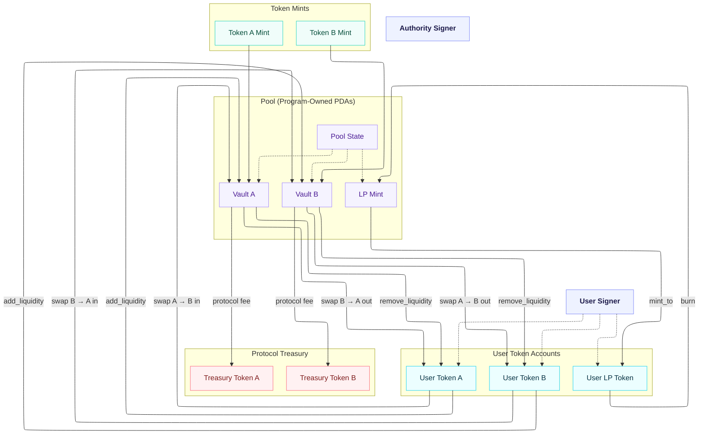

# Architecture and Account Diagram

This document explains how protocol accounts are derived, connected, and validated.

## 1. Program and PDA Graph

Program id:

- `2Hy7ouFwJLkG7cpAoSR4hGaFk3zPH2gAYLKjTMdGsqQs`

Canonical addresses:

- Pool state PDA: `[b"pool", token_a_mint, token_b_mint]`
- Vault A PDA: `[b"vault_a", pool_state]`
- Vault B PDA: `[b"vault_b", pool_state]`
- LP mint PDA: `[b"lp_mint", pool_state]`

## 2. Account Relationship Diagram

## 3. PoolState Layout

`PoolState::MAX_SPACE = 359 bytes` includes discriminator and all fields.

Key groups:

- Identity and routing: token mints, vault addresses, LP mint.
- Fee config: LP fee bps and protocol fee bps.
- Admin controls: authority and pause state.
- Observability: `k_last` and TWAP cumulative fields.

## 4. Constraint Mapping (Anchor)

Most safety checks are expressed through account constraints:

- `init` on pool state and PDA-owned token accounts prevents re-init overwrite.
- `seeds` and `bump` enforce canonical account derivation.
- `address = pool_state.<field>` pins vault/mint account routing.
- `has_one = authority` gates admin operations.
- Mint constraints on treasury rotation ensure token-type correctness.

## 5. Design Notes

- The `authority_bump` field is reserved for layout stability in future upgrades.
- TWAP fields are in core state to avoid migrations when adding oracle consumers later.
- Protocol treasuries are external token accounts for explicit fee custody.
